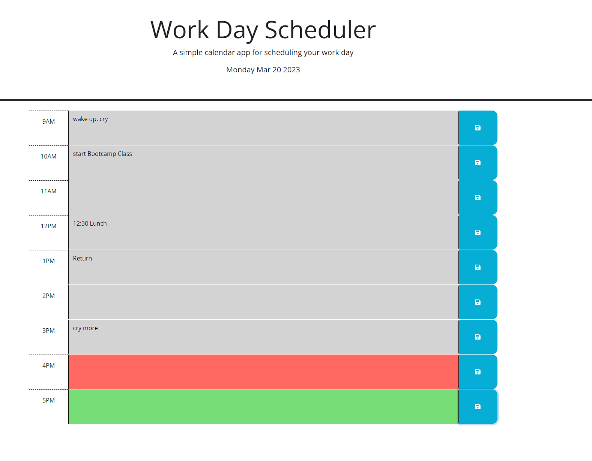

# Work Schedule Planner

## Description
A web app to help keep track of your busy schedule and organize your day. The time slots are color-coded to easily identify whether the event past, present, or future. 
## Installation
n/a

## Usage
Type your event or reminder into the text area in each timeslot and click save to post it to local storage. Even if you refresh the page or close out the window, the event will persist in the box until a new event is entered.

## Credits
N/A

## License

Please refer to the LICENSE in the repo.

---